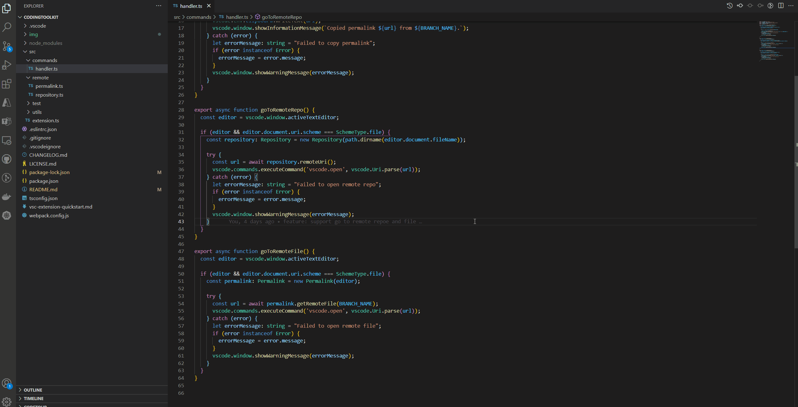
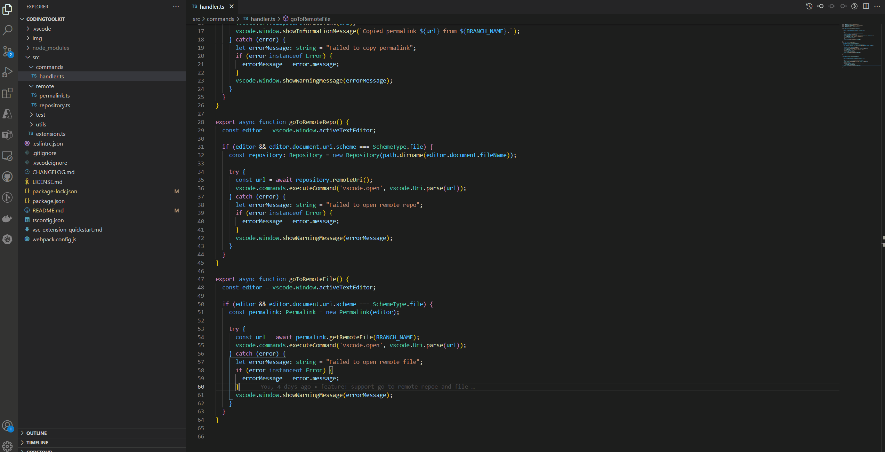
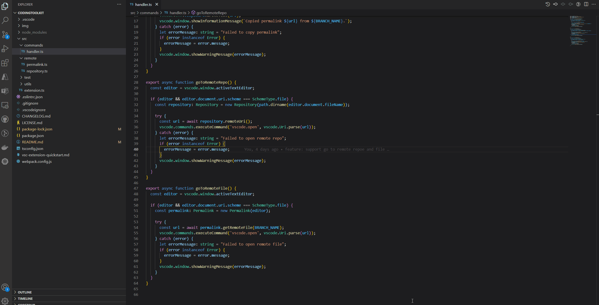

# Coding Toolkit

**Coding Toolkit** is a set of tools that help developer to write code efficiency in daily routine. Happy Coding!

## Feature
- copy github permalink
- go to remote repo
- go to remote file

## Usage
- copy github permalink
  - Open command pallete (with **Cmd-Shift-P** or **⇧⌘P**).
  - Type in "**Coding Toolkit: Copy Permalink**" and select it.
  - The GitHub permalink is auto generated and copied.
    - Permalink sample: `https://github.com/1openwindow/codingtoolkit/blob/66d186c0d65ac33e7e07e6679e59d97e77fdbc55/src/extension.ts#L4-L8`
  - 

- go to remote repo
  - Open command pallete (with **Cmd-Shift-P** or **⇧⌘P**).
  - Type in "**Coding Toolkit: Go To Remote Repo**" and select it.
  - The remore repo uri will be opened in default browser.
  - 

- go to remote file
  - Open command pallete (with **Cmd-Shift-P** or **⇧⌘P**).
  - Type in "**Coding Toolkit: Go To Remote File**" and select it.
  - The selected file will be opened in browser.
  - 

## Issues
Submit the [issues](https://github.com/1openwindow/codingtoolkit/issues) if you find any bug or have any suggestion.

## Contribution
Fork the [repo](https://github.com/1openwindow/codingtoolkit) and submit pull requests.